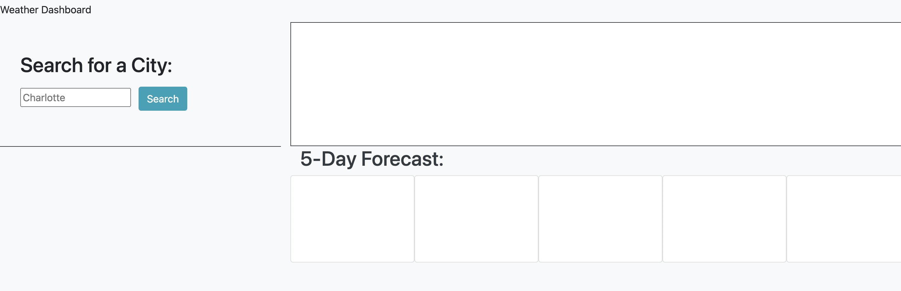
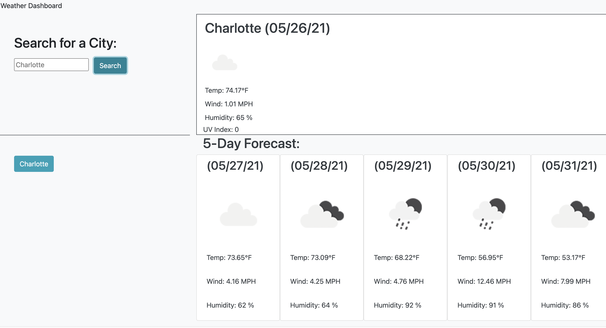
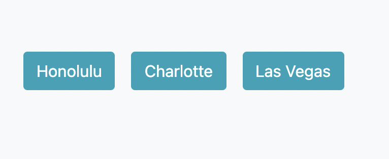

# Weather App Project

## Table of Contents

- Description
- Usage

[Description](#Description)

For this project, I created a weather application that allows you to insert a city of your choice and pull the weather results, uv index, and a five day forcast for the city you chose. The highlight of this application is the weather api that is used to pull in all of this information. 

Starting with the main web page, I used bootstrap to divide it into four sections. The first section handles the search functionality. In the first section, there is an input field and a search button. If you type the name of a city into the input and press the search button, it will insert that city name into the weather api and pull up the corresponding information. 

The second section is used to display this information. The city name and date that you accessed this information will appear at the top, an icon of the weather will appear below it, and the tempature, wind speed, uv index, and humidity are all displayed below the city name. 

The third section can be used to see the history of the cities you have search. The fourth section displays the 5-day forecast. Similarly to the main weather information, the date, and icon of the weather, and the tempature, wind speed, and humidity are all displayed in five seperate boxes.

[Usage](#Usage)

To use this application, you start by typing a city name into the search input, after clicking the search button, your results will appear on the left. Below the search field, a button will appear with the name you inputted. On the left, you will see all of the weather information and a five day forcast, all with live updating dates and weather details.

Here is a link to the deployed site: https://morrisbianco.github.io/weather-app-project/
